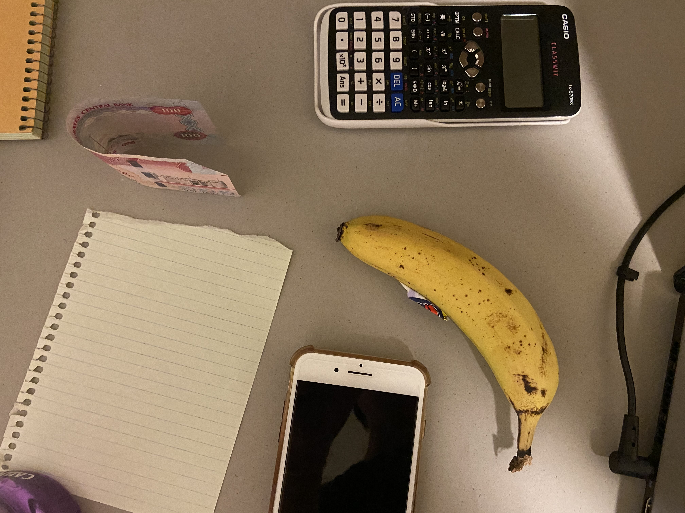

<html lang="en">
<head>
  <meta charset="utf-8">
  <meta name="viewport" content="width=device-width, initial-scale=1">

  <title>30MFF</title>
  <meta name="description" content="A simple HTML5 Template for new projects.">
  <meta name="author" content="SitePoint">

  <link rel="stylesheet" href="./styles.css">

</head>

<body>
  

    <a href="./index.html"><button class="exitButton">Go Back</button></a>
    

    <h2> Behind the Scenes </h2>
    

      
    

    

      

        
      

      

      

        <h4>Set set-up</h4>
        A picture of the equipment used for the shoot. Includes a phone, paper, calculator, banana and 100 dirham note.
      

    

    

    

      

        <h4>Happy Faces</h4>
        What is the point of making movies if not having fun? And plenty of fun were had as we discussed what props we had available on hand, when one of us brought up a banana which was somehow common between all three of us.
      

      

      

        
      

    

    

  

</body>
</html>